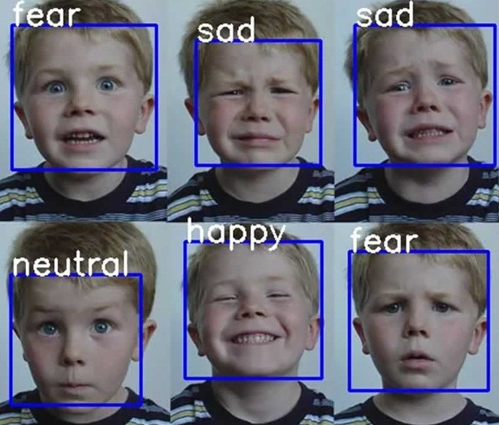

# Emotion-Detection
In this project I have trained a CNN from scratch to predict human emotions in real time using keras api. The model has achieved an accuracy among top 10 kaggle submissions.
## Kaggle Dataset Link
I had built and trained the model on kaggle kernel so thanks for their support.
-https://www.kaggle.com/c/challenges-in-representation-learning-facial-expression-recognition-challenge/data
## Check the predictions in Real Time
To use the model with your video cam feed just run 'VideoTest.py' file.
## Examples
Examples are included in the 'main_code.ipynb' jupyter notebook.
